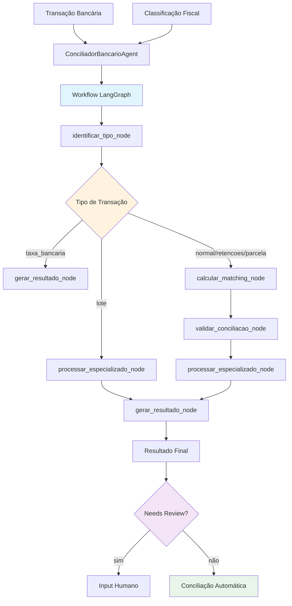

# Conciliação Bancária Inteligente

Sistema de conciliação bancária automatizada para documentos fiscais usando IA, baseado na arquitetura **LangGraph** com workflow modular.

https://github.com/user-attachments/assets/734d21e7-caa9-4dd1-87af-d87fa734cf82

## 🚀 Como Executar

### Instalação
```bash
# Instalar dependências usando uv
uv pip install -e .

# Ou instalar dependências individuais (incluindo LangGraph)
uv pip install streamlit pandas numpy python-dateutil pydantic loguru langgraph
```

### Execução da Interface Web
```bash
# Executar aplicação Streamlit
uv run streamlit run app.py

# Ou usando Python diretamente
python app.py
```

### Uso Programático
```python
from agents.conciliador_bancario import ConciliadorBancarioAgent

agente = ConciliadorBancarioAgent()
estado = {
    "transacao_bancaria": {
        "data_transacao": "2025-01-15",
        "valor_transacao": 1500.00,
        "descricao_transacao": "PIX VENDA PRODUTO XYZ",
        "tipo_transacao": "Crédito"
    },
    "classificacao_disponivel": {
        "cfop": "5102",
        "valor_total": 1500.00,
        "data_documento": "2025-01-15"
    }
}

resultado = agente.conciliar(estado)

# Obter informações do workflow LangGraph
workflow_info = agente.get_workflow_info()
print(workflow_info["workflow_type"])  # "LangGraph StateGraph"
```

### Arquitetura (visão rápida)


## 📊 Status de Documentos

O sistema pode retornar os seguintes status de conciliação:

| Status | Descrição |
|--------|-----------|
| `Conciliado_Automatico` | Conciliação perfeita sem divergências |
| `Conciliado_Com_Ressalva` | Conciliado com pequenas divergências |
| `Conciliado_Com_Retencoes` | Pagamento com impostos retidos |
| `Conciliado_Parcial` | Pagamento parcelado identificado |
| `Conciliado_Lote` | Múltiplos documentos em uma transação |
| `Nao_Conciliado` | Não foi possível conciliar |
| `Nao_Conciliavel` | Taxa bancária ou transação sem documento fiscal |

## 🏗️ Estrutura do Projeto

### Arquitetura LangGraph
```
conciliacao-agent/
├── agents/
│   ├── conciliador_bancario.py           # Orquestrador LangGraph (80 linhas)
│   └── workflow/                         # 📁 Workflow LangGraph
│       ├── __init__.py                   # Exports principais
│       ├── state.py                      # Estados tipados (ConciliacaoState)
│       ├── nodes.py                      # 5 nós funcionais (450 linhas)
│       └── graph.py                      # Definição do workflow
├── models/
│   └── conciliacao.py                    # Modelos Pydantic
├── tests/
│   ├── data/                             # Dados de teste reais
│   └── test_data_generator.py            # Gerador de casos de teste
├── app.py                                # Interface Streamlit
├── pyproject.toml                        # Configuração + LangGraph
└── README.md                             # Este arquivo
```

### Nós do Workflow
- **`identificar_tipo_node`**: Identifica tipo de transação (taxa, lote, normal, etc.)
- **`calcular_matching_node`**: Score fuzzy matching entre transação e documento fiscal  
- **`validar_conciliacao_node`**: Valida regras de negócio e identifica divergências
- **`processar_especializado_node`**: Processa casos especiais (retenções, lote)
- **`gerar_resultado_node`**: Gera output estruturado final

## 🧪 Testes

```bash
# Executar testes
uv run pytest

# Executar com coverage
uv run pytest --cov=agents --cov=models

# Gerar dados de teste
uv run python tests/test_data_generator.py
```

## ⚙️ Configuração

O agente utiliza os seguintes parâmetros de conciliação:

- **Tolerância de valor**: 5% ou R$ 50,00
- **Janela temporal**: 7 dias
- **Score mínimo**: 60%
- **Algoritmos**: Fuzzy matching, análise de valor e data
- **Arquitetura**: LangGraph StateGraph com 5 nós especializados

### Configuração Programática
```python
# Atualizar configurações do agente
agente = ConciliadorBancarioAgent()
agente.update_config({
    "tolerancia_valor_absoluta": 100.00,  # Aumentar tolerância
    "score_minimo": 0.70                  # Aumentar exigência
})

# Obter informações do workflow
info = agente.get_workflow_info()
print(f"Nós: {info['nodes']}")
```

## 📝 Formato de Entrada

```json
{
  "transacao_bancaria": {
    "data_transacao": "2025-01-15",
    "valor_transacao": 1500.00,
    "descricao_transacao": "PIX CLIENTE ABC LTDA",
    "tipo_transacao": "Crédito",
    "conta_bancaria": "341-12345-6"
  },
  "classificacao_disponivel": {
    "cfop": "5102",
    "natureza_operacao": "venda",
    "valor_total": 1500.00,
    "data_documento": "2025-01-15",
    "numero_documento": "NF-e 123",
    "parceiro_nome": "Cliente ABC LTDA"
  }
}
```

## 🎯 Benefícios da Arquitetura LangGraph

### ✅ Modularidade
- **5 nós independentes**: Cada função tem responsabilidade única
- **Testabilidade**: Nós podem ser testados isoladamente
- **Reutilização**: Componentes podem ser usados em outros workflows

### ✅ Observabilidade  
- **Tracking automático**: LangGraph registra execução de cada nó
- **Debug facilitado**: Visualização clara do fluxo de processamento
- **Métricas**: Performance e timing por etapa

### ✅ Extensibilidade
- **Novos tipos**: Fácil adição de novos tipos de conciliação
- **Roteamento condicional**: Fluxos diferentes baseados em contexto
- **Integração**: Pode ser parte de workflows maiores

### ✅ Compatibilidade
- **Interface mantida**: Método `conciliar()` funciona igual
- **Zero breaking changes**: Aplicação Streamlit inalterada
- **Migração transparente**: 530 linhas → 5 nós especializados

## 🔧 Casos de Uso Suportados

| Tipo | Exemplo | Status Retornado |
|------|---------|------------------|
| **Normal** | PIX de venda | `Conciliado_Automatico` |
| **Taxa Bancária** | Tarifa conta corrente | `Nao_Conciliavel` |
| **Retenções** | Pagamento com impostos retidos | `Conciliado_Com_Retencoes` |
| **Lote** | TED múltiplas NF-es | `Conciliado_Lote` |
| **Parcela** | 1ª parcela de 3x | `Conciliado_Parcial` |
| **Divergência** | Diferença de data/valor | `Conciliado_Com_Ressalva` |
